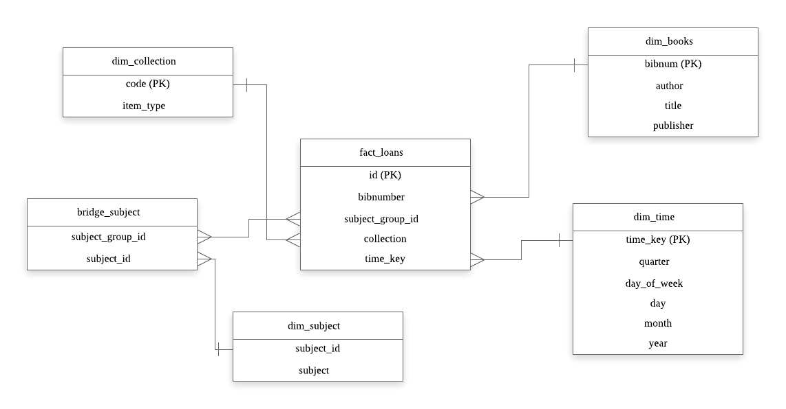
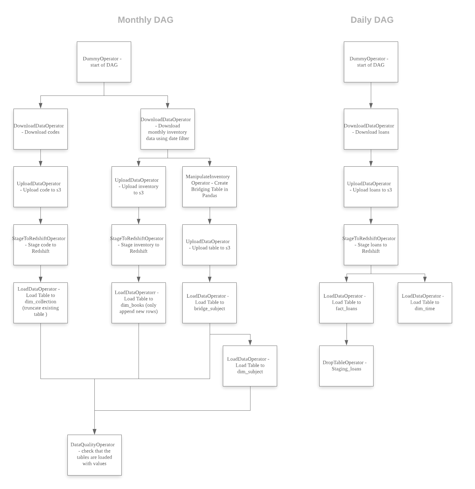
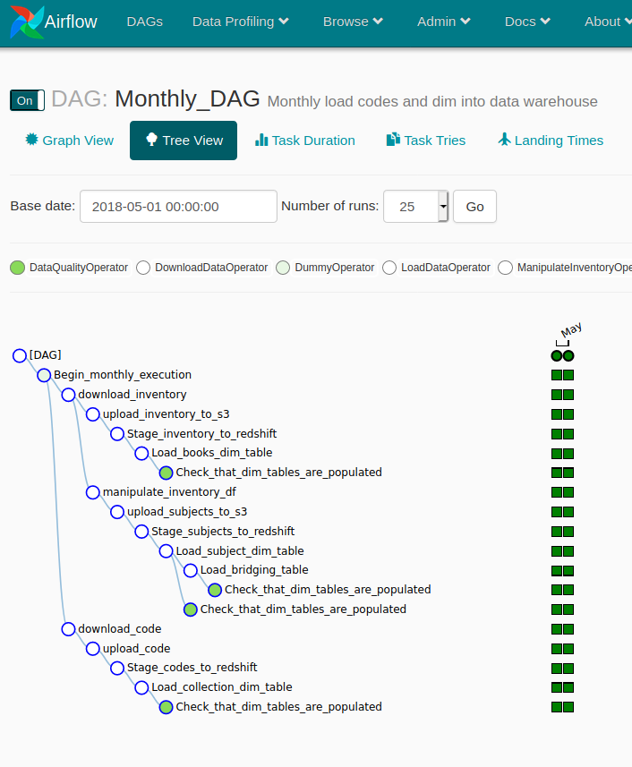
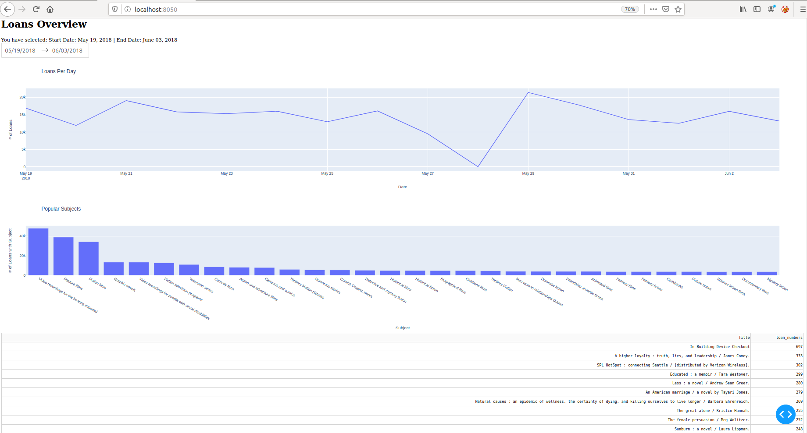

# Library Data Warehouse
## Introduction
Imagine the use case to be that of a librarian at Library HQ that wants to have an overview of the borrowing patterns of the library users. What he/she would want to know are simpler information like the day to day loan numbers, as well as the popular titles and the popular subjects that users want to borrow. This would enable him/her to make better recommendations on what subjects of books to acquire moving forward.

## Dataset & Meaning
**Seattle Public Libraries Physical Title Checkout** (100+M rows to date, daily updated) found in: https://data.seattle.gov/Community/Checkouts-By-Title-Physical-Items-/5src-czff
  
| Field in Dataset   | Remarks                                    |  
|--------------------|--------------------------------------------|  
| ID                 | ID of each loan                            |
| CheckoutYear       | the year value for each loan               |
| BibNumber | bibnumber is same for identical titles (is likely FK to Books Collection Dataset)    |
| ItemBarcode        | unique for each book item                  |
| ItemType           | Type of item                               |
| Collection         | What collection is book from               |
| CallNumber         | Dewey number for each book                 |
| ItemTitle          | Item title                                 |
| Subjects           | comma separated, values of subjects of book in a string. |
| CheckoutDateTime   | Timestamp of loan |

**Seattle Library Books Collection Dataset**, 40+M rows, monthly updated from https://data.seattle.gov/Community/Library-Collection-Inventory/6vkj-f5xf   
 Books only dataset. Provides additional information about the book being loaned
| Field in Dataset   | Remarks                                    |  
|--------------------|--------------------------------------------|  
| BibNum             | bibnumber is same for identical titles     |
| Title              | Title of item                              |
| Author             | Unfortunately, the naming of the author is not consistent even for books with same author|
| ISBN               | ISBN information. Consist of a list of comma separated values |
| PublicationYear    | Year of publication. Inconsistently formatted, comma separated values |
|Publisher | the naming of the publisher is not consistent |
|Subjects  | comma separated, values of subjects of book in a string. |
| ItemType           | Type of item                               |
| ItemCollection           | What collection is book from         |
| ItemType           | Type of item                               |
| FloatingItem       | Label to demarcate if item is in temp location             |
| ItemLocation       | where the book is located.                 |
| ReportDate         | every month, the library appends library inventory to dataset without removing previous rows. this is the reportdate |                        
| ItemCount          | quantity of books at each location         |

**Seattle Library Integrated Library System (ILS) Data Dictionary**, 500+ rows from https://data.seattle.gov/Community/Integrated-Library-System-ILS-Data-Dictionary/pbt3-ytbc  
Provides some additional information about some of the categories used. This table cannot be used as is, will probably need to break it down into smaller tables because it appears that col `Code` appear into multiple columns such as ItemCollection, Collection
1. Code
2. Description
3. Code Type
4. Format Group
5. Format Subgroup
6. Category Group
7. Category Subgroup
8. Age Group

## Boundary Setting  
There is alot of much data to ingest. I feel that it is not practical to ingest all the data for the purpose of doing a prototype, so i only intend to ingest a couple of months of data for the sake of demonstration. Even bounding to 2 months of inventory and loan data would involve nearly >3M rows of raw data:  
1. Library Physical Book Inventory (2m+ rows)
2. Loan data for 2 months (~1M rows)
3. Data Dictionary (~500 rows)

## Design Considerations  
I decided to go ahead with Redshift because the volume of data is well within Redshift's capabilities and not use locally hosted resources. Also, Redshift cluster is more cost-effective than Spark since the cluster would need to be always on to support the dashboard. A single node Redshift cluster is used to test the implementation.  
For the end user analyst, a prototype dashboard is built using Dash and Plotly, which can be hosted on a stand-alone EC2 instance if required.  
2 Airflow DAGS is used: 
1. a "monthly" DAG where inventory and code datasets were downloaded from Seattle Open Data Portal, and processed.
2. a "daily" DAG where loan data is downloaded daily, this would allow analysis of the most recent data on a timely basis.

## Data Model:  
The implemented model is shown as such:  
  
A star schema is used to meet the dashboarding requirements. In the case of trying to analyze subjects, a bridging table is used to connect the fact table to the subject dimension. This is because each book has at least 1 subject, and usually have multiple subjects associated with it.  
This was not covered in the Udacity Data Engineering course, and i had to research a fair bit on the internet to find a solution.  
1. https://www.kimballgroup.com/2012/02/design-tip-142-building-bridges/  

### About Fact Table    
I decided to use individual loans as the atomic grain and not aggregate it into daily loan numbers, because it would help with the breakdown of subjects later.
### Dimension Tables  
Not all the columns in the raw datasets were used. This is because an EDA of the data revealed significant complexity in cleaning and normalizing the dataset. For instance, publicationyear is a field containing possibly comma separated values and some examples of the data is as shown:  
1. 2005—publication date
2. c. 2005 – copyright symbol
3. [2005] – Printing date
4. p. 2005 – phonogram copyright symbol
5. 2004, c. 2005 – publication and copyright date
6. 2005-2007 – intervening years
7. [2005?] – Approximate date   

To standardise the values would require significant effort to clean up the text strings. As such, I decided to only touch Author, Title, Publisher and Bibnumber in the dim_book table. I also noticed significant overlaps in the physical inventory, because all the copies of a title is spread over multiple libraries. I decided to deduplicate the rows to form the basis of the book dimension. In any case, the information that I dropped was not useful because the loans raw data do not contain information about which branch the loan is from.

## Bridge Tables  
I would be able to left outer join the fact table with the dim_subject using the bridge table as the intermediatary to get a count of the subjects that readers likes to read. I noticed in my EDA that the subjects field in the loan table is different from that of the subjects field in the inventory dataset, hence decided to standardise the subjects field by using the subjects field from inventory instead. MD5 hash is used to generate the subject_id_group.

## ETL Process
An overview of the tasks in Airflow is shown below:  
  
The Monthly DAG can be executed at the end of each month, while the daily DAG should be ran at the end of each day.   

## Operators
Explanation of the purpose of each Operator in Airflow used is in the docstrings

## Airflow dashboard  
The tasks run smoothly in general and each daily DAG needs an average of 3 minutes to run. There is a daily run that failed because that day was Memorial Day 2018, and the library has no data that day.  
  
Each monthly DAG needs about 5 minutes to run, partially due to the larger volume to download from Socrata.
  

## Dashboard
A screenshot of the application dashboard is shown below. The user could make changes to the data and the dashboard will update the query to Redshift. Updates will take a couple of seconds to effect.  
 

## Further Scenarios to be explored:  
Include a description of how you would approach the problem differently under the following scenarios:
If the data was increased by 100x.
I will scale up the Redshift cluster in both nodes and node type.

If the pipelines were run on a daily basis by 7am.  
Not applicable since the daily DAG is meant to be ran daily.

If the database needed to be accessed by 100+ people.
I will scale up the Redshift cluster. Currently accessing the data via the dashboard incurs an acceptable delay in the order of a few seconds (for Redshift to aggregate and send the required information over)

## Improvements that could be made:  
Additional fields could be added to the warehouse, however, I felt that it would incur too much time to design the ETL process to process the messy data.
SubDAGs could be used to simply the download-upload_toS3 tasks.
More data checks could be added.

## Lessons learnt  
In this Nanodegree, I've learned more about database/warehouse design, Spark and Airflow and have deepened my understanding in SQL through the writing of more complex queries to store the information. Although I am not looking to break into the data engineer role, I believe that understanding how data is collected, stored would help me more in the future in Data Science.